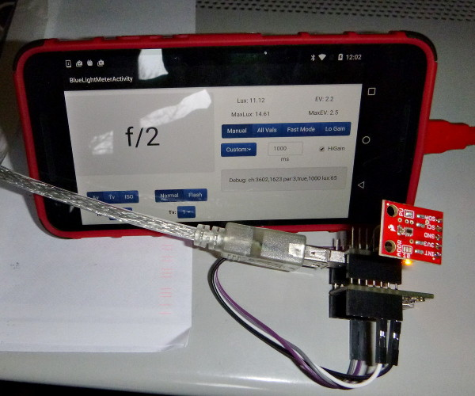
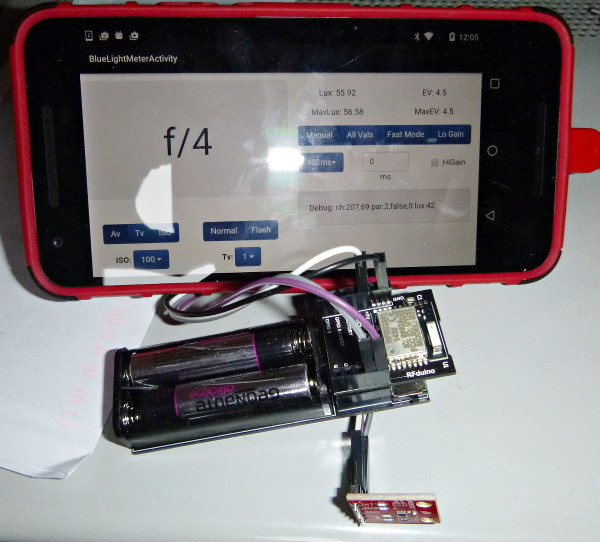

# Blue Light Meter

This project develops a remote light meter for photography that can be
used, via Bluetooth LE, from an Android/Linux phone. Maybe some day in
the future a lightmeter GATT profile could be developed and camera may
use it. Miniaturized BTLE enabled light meters could be easily carried
around or concealed in clothes while shooting.

## Hardware

The initial hardware is very simple. A TSL2561 Sparkfun breakout is
connected to a RFDuino module (the 4 lines SCA, SCL, +3.3V and
GND). The biggest part is the RFDuino coin cell battery module. The
battery itself would probably be the biggest part in a custom designed
hardware, considered the dimension of the nRF51822 and the light
sensor. I compared the result to low-cost light meters and the
agreement is OK, but more testing is needed. Also I'm experimenting
with different sensors that also deliver an information about the
color temperature of the light. An enclosure made with a 3D printer is
in the plans, the most problematic part is the diffuser to protect the
light sensor.

The prototype:  
and .

## Software

The functionality is pretty standard as for all light meters. You
choose which one you want to calculate from the aperture value, the
exposure time and the ISO. You set the value for the other 2. You can
select normal or flash mode. In the first case the calculation will be
done on the average measurement from the last 3 seconds, otherwise the
maximum will be used.

The rest of the controls is specific to the TSL2561 sensor. You can
see the medium and maximum measured Luxs or EV in the last 3
seconds. Then you can select if the parameters for the sensor are set
manually or automatically by the app. In the former case you can
select the integrating time from the built-ins ore use a custom
one. Also you can enable hi-gain mode. If you choose automatic mode
the app itself will try to choose the right parameters (having a
significant reading without risking a saturation). You can choose
between using all available modes, only faster ones (for quicker
response) or try to use low gain (for better SNR). There are also
debug information available, status of connection and, after it is
established, the value read from the sensor. For the Android version
also the value read from the internal light sensor (in Lux) is
available to check the BlueLightMeter readings. This value is also
used if BLM is not found, so yes, this is also yet another built-in
light meter application.

### RFDuino server

The application uses the simple main loop approach idling while
broadcasting its identification. When connected it starts reading the
light sensor, sending the data and receiving configuration updates. It
was tested with RFDuino BSP 2.3.1. Before compiling (simply invoking
make) you have to set the environment variables RFDUINO to the
location of the BSP (usually
$HOME/.arduino15/packages/RFduino/hardware/RFduino/2.3.1/ if you
followed standard installation) and RFDUINO_PORT to the USB port used
(/dev/ttyUSB0 or following, depending on which devices you have
connected). The target make download installs the compiled application
to RFDuino.

### BusPirate client

This is a simple BusPirate library in C that I use for testing
sensors. It has an implementation of the TSL2561 reading algorithms.

### Python client

The Python client uses dbus interface to bluetoothd for accessing the
RFDuino. Please note that the experimental interface for accessing
GATT services is need, so assure that bluetoothd is started with the
-E option (eventually by editing the configuration file, for systemd
it is bluetooth.service). The clients needs python-dbus and pygtk-2.0
Python modules.

The client is structured in 3 separate classes for simpler reuse. BLM
is the low-level communication with RFDuino that can be used as a
template for generically accessing Bluetooth LE device under
Linux/Python. BLMThread implements the sensor algorithms and GUI is
the user interface.

### Android client

For a rapid development, only the communication part is in Java, the
sensor algorithms and the UI are in JavaScript and use a responsive
Bootstrap user interface (running in a WebView). The
BlueLightMeterDriver class implements the low-level communication with
RFDuino. The data gathered are exported, through the data-model class
BlueLightMeterData, as BLM to the WebView. BlueLightMeterData also
exposes methods for setting the sensor parameters.

